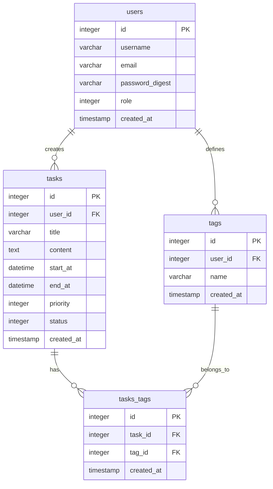

# 任務管理系統 (Task Management System)

這是5倍紅寶石 任務管理系統 的實作專案。

## 系統需求
- Ruby 3.4.2
- Rails 8.1.2
- PostgreSQL 16+

## 部署網址
  - [Render 網址] https://task-management-system-rivq.onrender.com/tasks

## 本地開發
1. `bundle install`
2. `rails db:create && rails db:migrate`
3. `rails s`

## 部署方式
- 本專案部署於 **Render**。
- 每次推送到 `main` 分支時，Render 會自動觸發部署。

## 網站操作
- 可點擊 新增任務 按鈕新增任務
- 可檢視、編輯、刪除 任務

* Database creation

